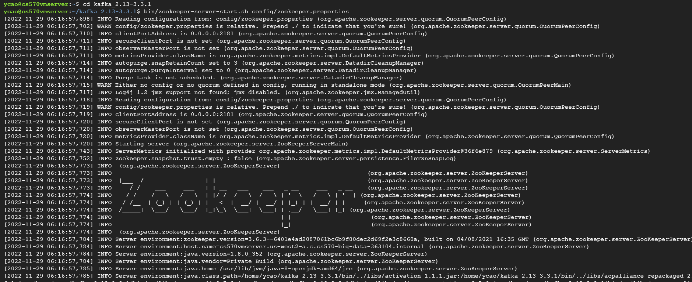
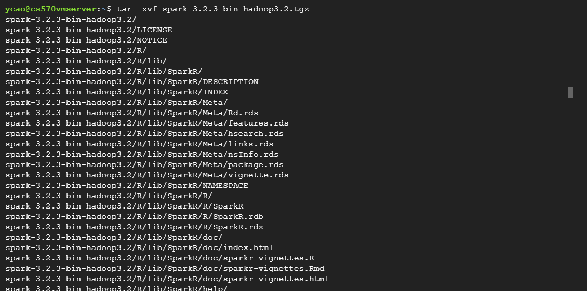
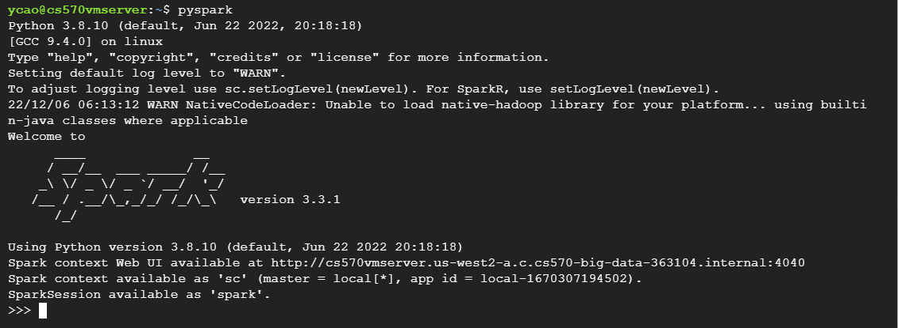
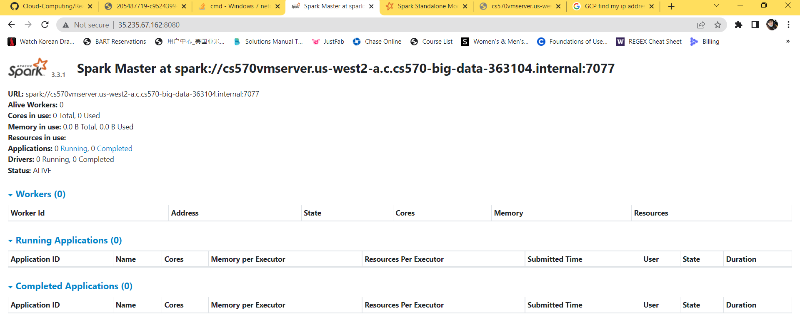
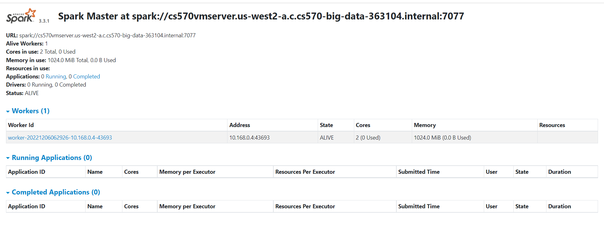

# Section 1: Study the basic concepts about Kafka

Three primary concerns in Real-time data ingesting are:
  
  How we will [consume, produce, and process] these events efficiently?
  
  Apache Kafka addresses the first two problems stated above. The Zookeeper helps to maintain the server state and stores configurations as a key value pair in ZK data tree, and use them across the cluster in a distributed manner.
  
  


**[Quick Start](https://kafka.apache.org/quickstart)**

### Step 1: Get Kafka

[Download](https://kafka.apache.org/downloads) the latest Kafka release and extract it:

```
$ tar -xzf kafka_2.13-3.3.1.tgz
$ cd kafka_2.13-3.3.1
``` 


### Step 2: Start the Kafka Environment
*NOTE: Your local environment must have Java 8+ installed.*

##### Start the ZooKeeper service
```
$ bin/zookeeper-server-start.sh config/zookeeper.properties
```



##### Start the Kafka broker service
*Open another terminal session and run:*
```
$ bin/kafka-server-start.sh config/server.properties
```


### Step 3: Create a Topic to Store Your Events

Before you can write your first events, you must create a topic. Open another terminal session and run:
```
$ bin/kafka-topics.sh --create --topic quickstart-events --bootstrap-server localhost:9092
```


To list all current topics:
```
$ bin/kafka-topics.sh --list --bootstrap-server localhost:9092
```

### Step 4: Write Some Events into the Topic

Open another terminal session and run the console producer to write the events to topic:
```
$ bin/kafka-console-producer.sh --topic quickstart-events --bootstrap-server localhost:9092
```

You can stop the producer client with Ctrl-C at any time.

### Step 5: Read the Events
Open another terminal session and run the console consumer client to read the events you just created:
```
$ bin/kafka-console-consumer.sh --topic quickstart-events --from-beginning --bootstrap-server localhost:9092
```

You can stop the consumer client with Ctrl-C at any time.


# Section 2: Study the basic concepts about Spark Streaming
[Spark Streaming Guide](https://spark.apache.org/docs/latest/streaming-programming-guide.html)

Spark Streaming provides a high-level abstraction called discretized stream (DStream), which represents a continuous stream of data.
  DStreams can be created from input data streams from sources such as Kafka, Flume, and Kinesis, or by applying high-level operations on other DStreams.
  Internally, a DStream is represented as a sequence of RDDs.
  
  
  
WordCount-Streaming Example 
  
  

#### *Environment setup please refer to Section 3 - Step 1*

* First, run Netcat (a small utility found in most Unix-like systems) as a data server
```
$ nc -lk 9999
```

* Then, in a different terminal, start the network_wordcount.py example
```
$ ./bin/spark-submit examples/src/main/python/streaming/network_wordcount.py localhost 9999
```

# Section 3: Connecting the Dots (Python, Spark, and Kafka)

### Step 1: Installing Spark


[Set Up Spark and Kafka on Windows 11]()

##### Download spark package
```
$ wget https://www.apache.org/dyn/closer.lua/spark/spark-3.3.1/spark-3.3.1-bin-hadoop3.tgz
```


##### Unpack
```
$ tar -xvf spark-3.3.1-bin-hadoop3.tgz
```


##### Create soft links (optional)

This step is optional, but preferred; it facilitates upgrading spark versions in the future.
```
$ ln -s /home/xxx/spark-2.3.2-bin-hadoop2.7/ /home/xxx/spark
```


##### Add SPARK_HOME entry to bashrc
```
$ SPARK_HOME="/home/xxx/spark"
$ export PATH=$SPARK_HOME/bin:$PATH
$ export PATH=$SPARK_HOME/sbin:$PATH
```


##### Verify the installation
```
$ pyspark
```
The following output would be visible on the console if everything were accurate:


##### Start the master in this machine
```
$ start-master.sh
```


Spark Master Web GUI (the flowing screen) is accessible from the following URL: http://abc.def.com:8080/



##### Starting Worker
```
$ start-slave.sh spark://abc.def.ghi.jkl:7077
```



