# **PySpark: DataFrames / SparkSQL  + GraphFrames / GraphX**
## **Step 1: Create Cluster on GCP**


*   Refer to previous HW to create
*   Open a terminal through SSH
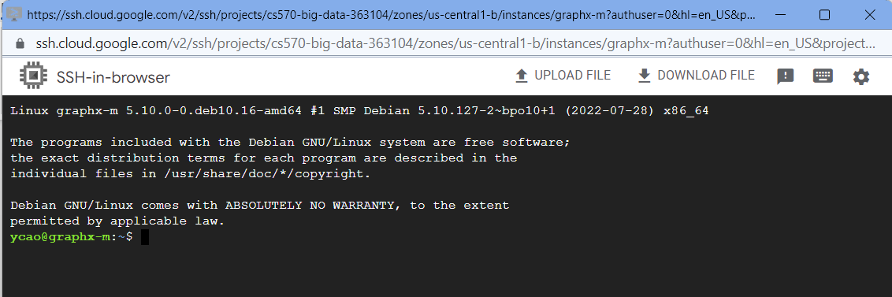

## **Step 2: Data Prepare**

*   Upload the csv data files from local to cluster


*   Check Upload

```
$ ls
```


*   Create HDFS file system and copy the data files to HDFS

```
$ hdfs dfs -mkdir hdfs:///mydata
$ hdfs dfs -put ./*.csv hdfs:///mydata/
$ hdfs dfs -ls hdfs:///mydata
```
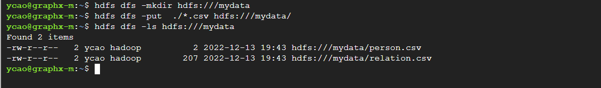

*   Create the graphdemo.py file and change the path for data files

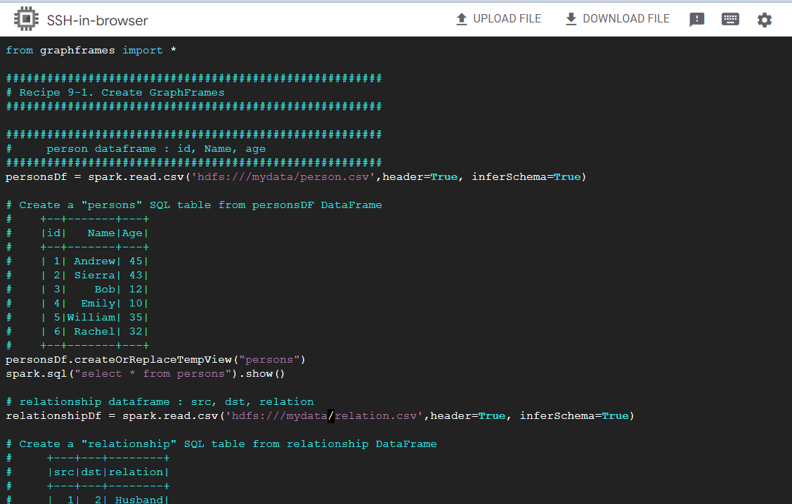


## **Step 3: Run the code in pyspark shell line by line**

```
$ pyspark
```

*   GraphFrame module not found, solve the problem by adding packages

```
$ pyspark --packages graphframes:graphframes:0.8.2-spark2.4-s_2.11
```

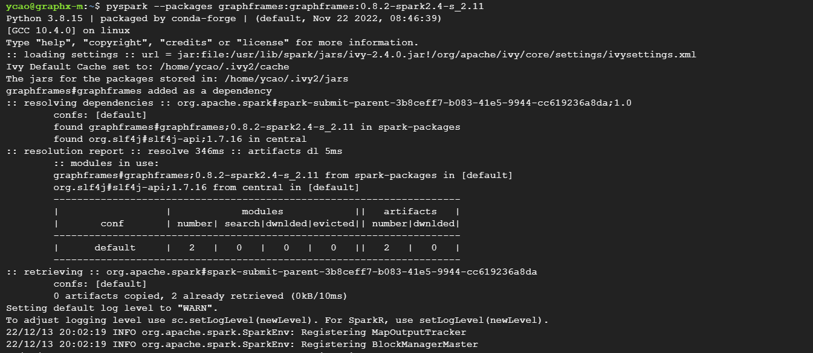

*   New error

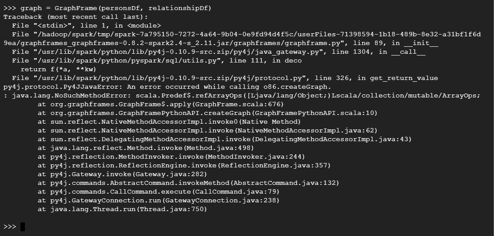

*   Check pyspark version and find correspondence jar [package](https://spark-
packages.org/package/graphframes/graphframes)

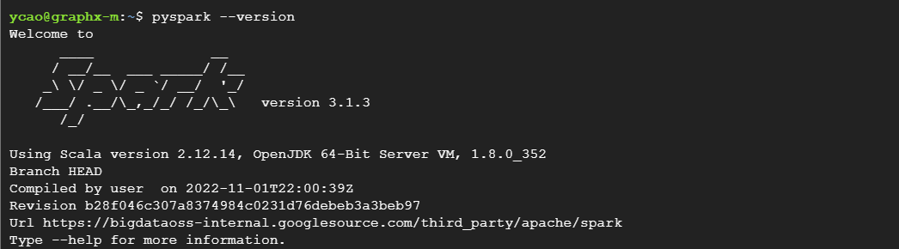

*   Try again

```
$ pyspark --packages graphframes:graphframes:0.8.2-spark3.1-s_2.12
```
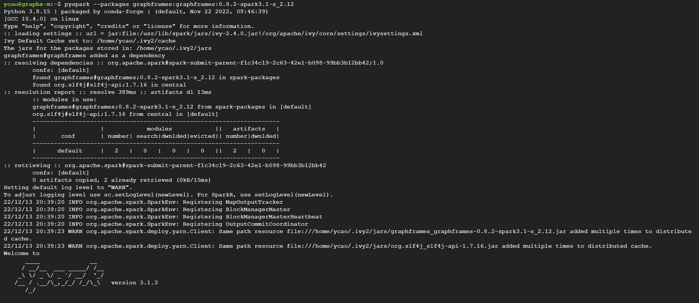

*   Success in pyspark-shell, run remaining code

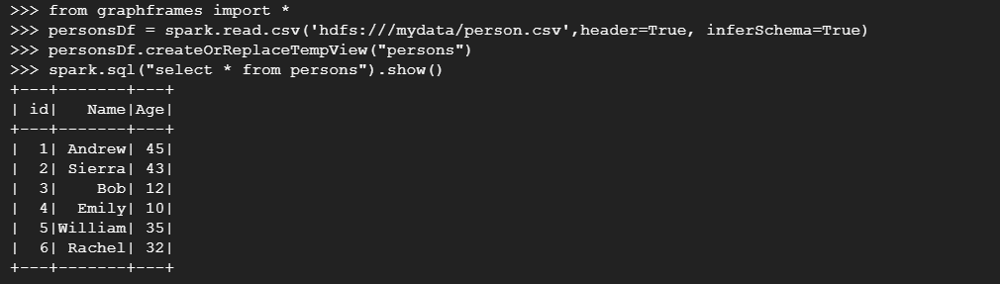
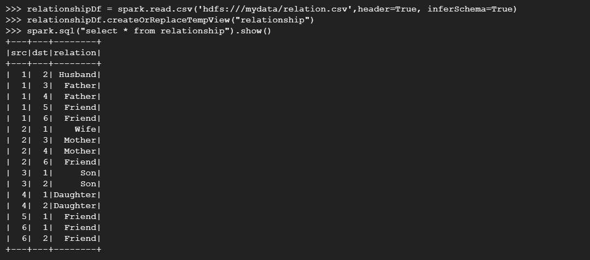
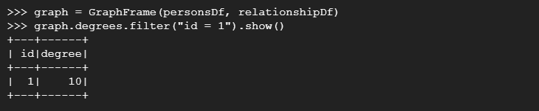
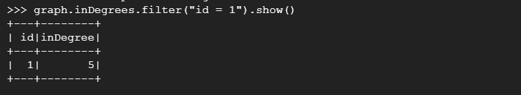
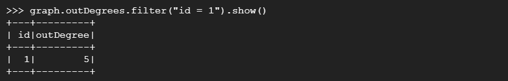
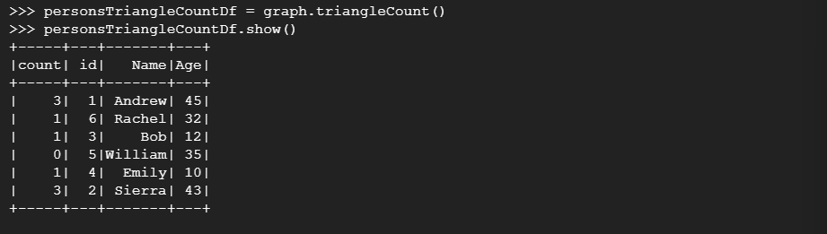
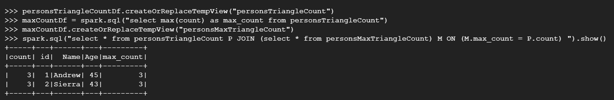


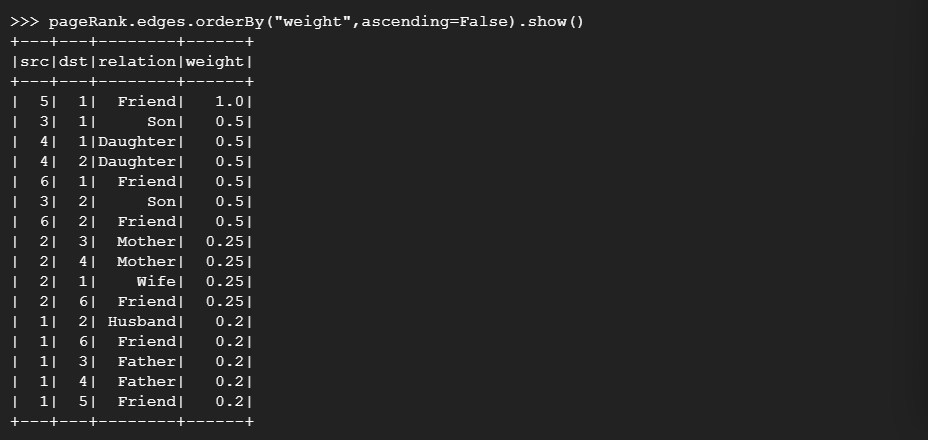
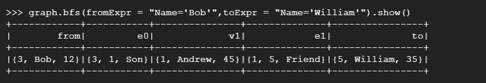
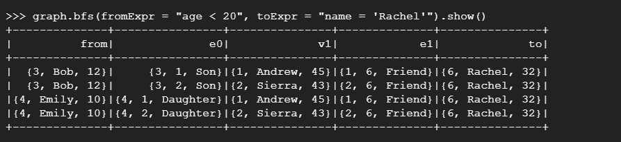
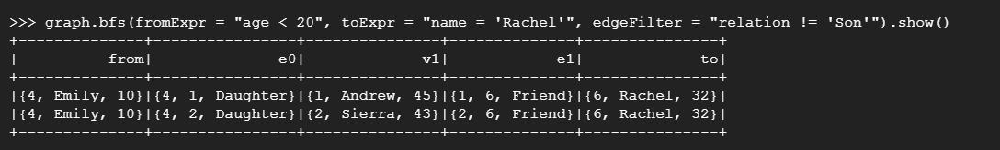


## **Step 4: Run the code with spark-submit**

*   With experience of fixed errors earlier
*   Run code

```
$ spark-submit --packages graphframes:graphframes:0.8.2-spark3.1-s_2.12
graphdemo.py
```
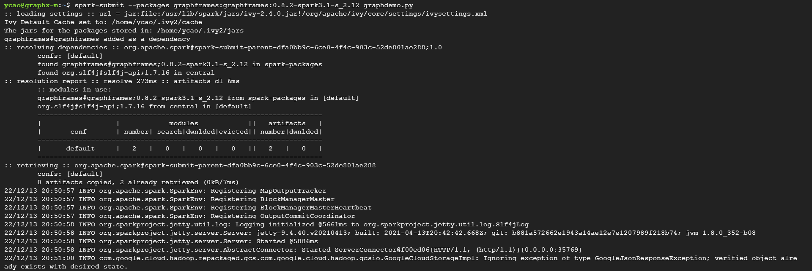

*   No spark found, add initial code for spark session

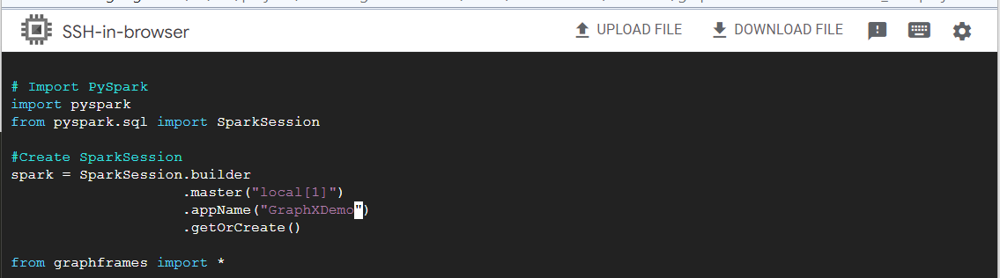

*   Run again
*   Typo found

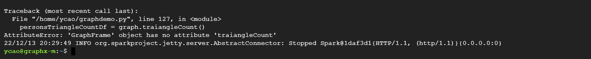

*   Fixed and run, successfully execute

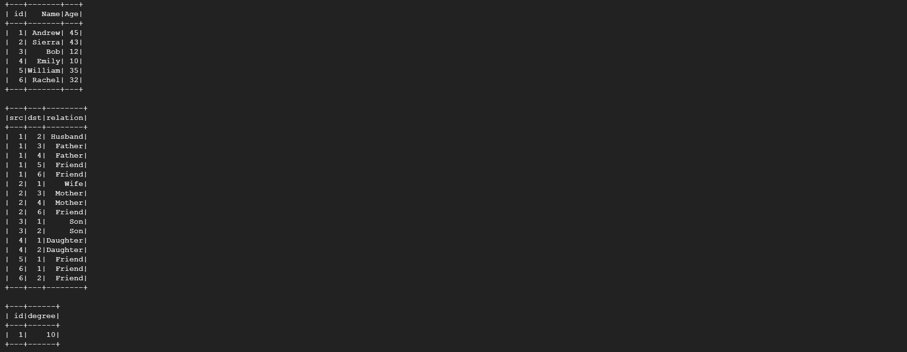
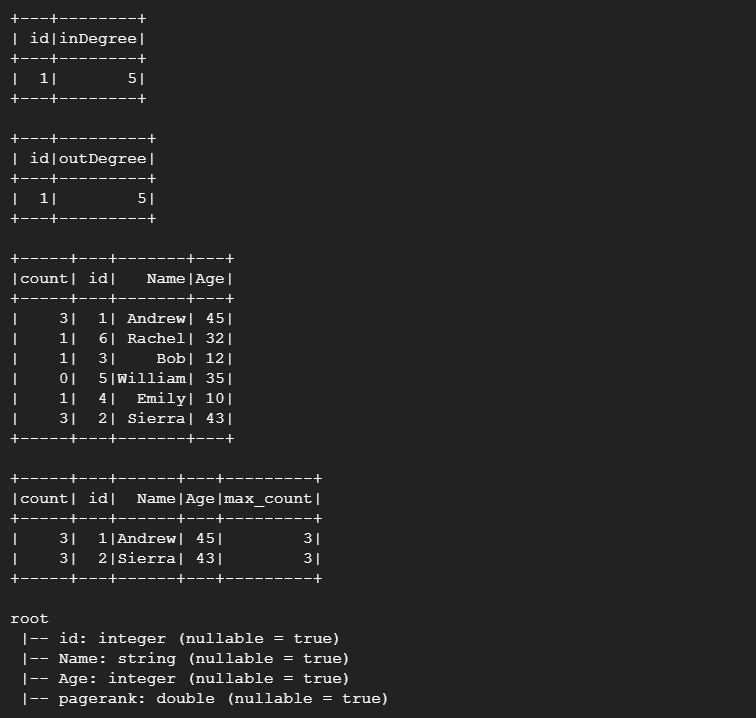
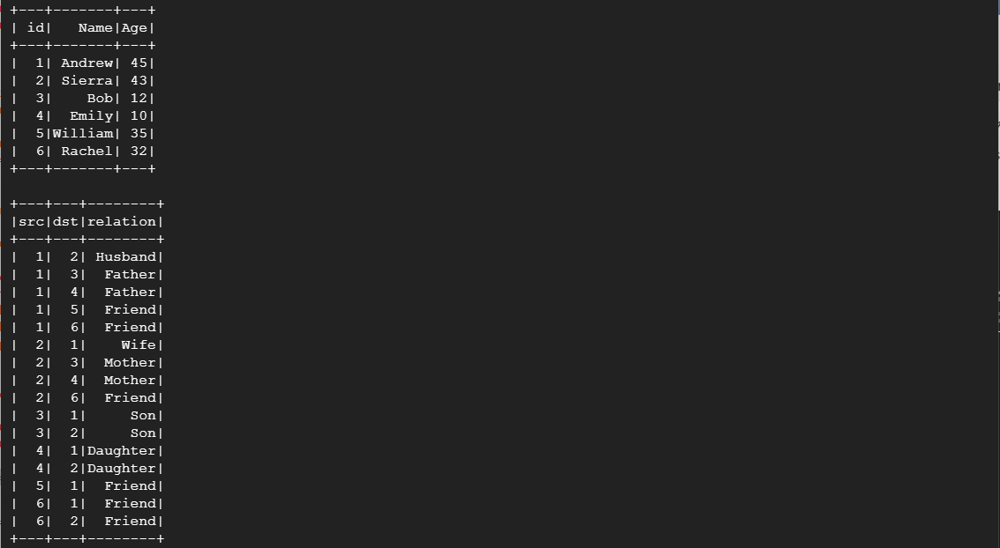
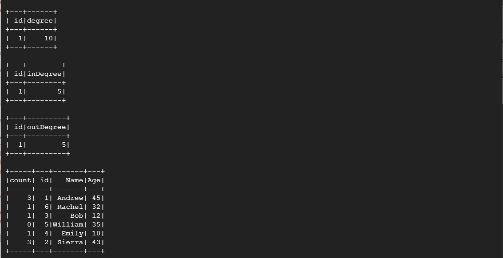
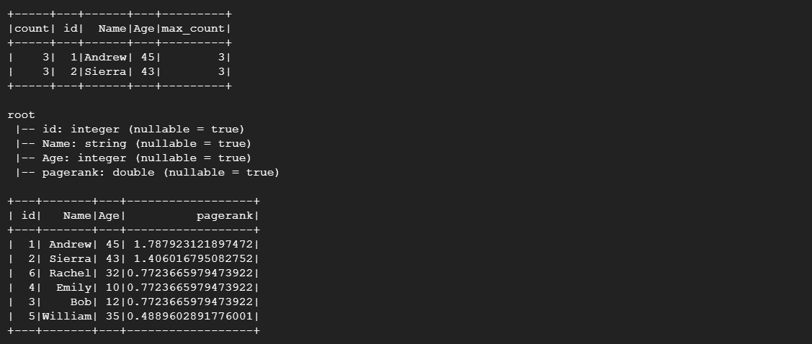
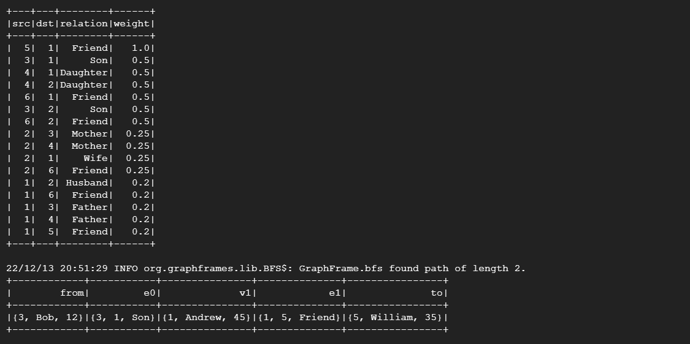
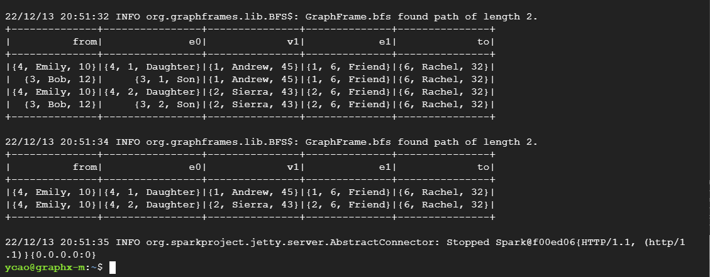


