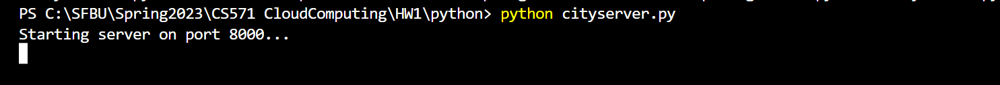
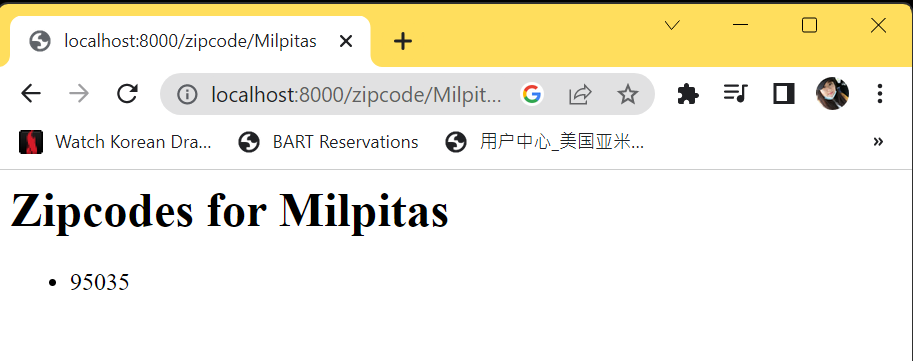
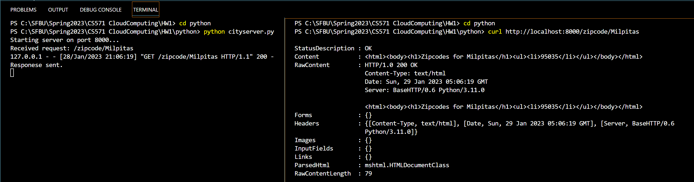
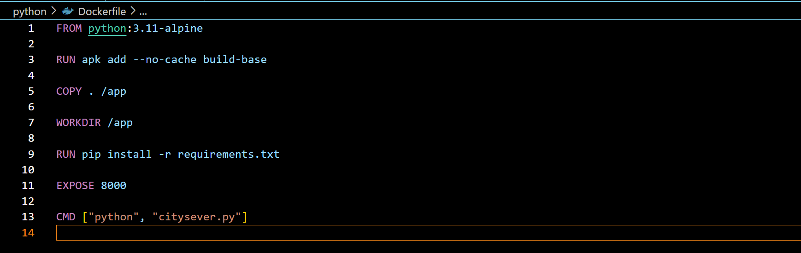
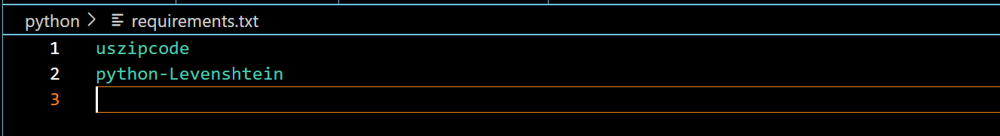

# **Microservice 1: City Name to Zipcode**

## **Setp 1: Create cityserver.py file to take city name and output zipcodes**

```
import uszipcode
from http.server import BaseHTTPRequestHandler, HTTPServer

class RequestHandler(BaseHTTPRequestHandler):
    def _send_response(self, message):
        self.send_response(200)
        self.send_header('Content-type', 'text/html')
        self.end_headers()
        self.wfile.write(bytes(message, "utf8"))

    def do_GET(self):
        print(f'Received request: {self.path}')
        if self.path.startswith('/zipcode'):
            city = self.path.split('/')[-1]
            search = uszipcode.SearchEngine()
            zipcodes = search.by_city_and_state(city,'CA', returns=0)
            if zipcodes:
                zipcode_list = [str(z.zipcode) for z in zipcodes]
                response = "<html><body><h1>Zipcodes for {}</h1><ul>".format(city)
                for zipcode in zipcode_list:
                    response += "<li>{}</li>".format(zipcode)
                response += "</ul></body></html>"
                self._send_response(response)
                print(f'Responese sent.')
            else:
                self._send_response('Invalid city name')
                self._send_response('Correct URL for searching: http://localhost:8000/zipcode/[city_name]')
                print(f'Sent response: Invalid city name')

def run(server_class=HTTPServer, handler_class=RequestHandler, port=8000):
    server_address = ('', port)
    httpd = server_class(server_address, handler_class)
    print(f'Starting server on port {port}...')
    httpd.serve_forever()

run()
```

## **Step 2: Test cityserver.py**
### **1) In Broswer**

* Run cityserver.py
```
$ python cityserver.py
```



* Open browser with URL: http://localhost:8000/zipcode/[city_name]



### **2) With curl**

```
$ curl http://localhost:8000/zipcode/[city_name]
```




## **Step 3: Create Dockerfile**


## **Step 4: Create requirement.txt**


## **Step 5: Build Image**


## **Step 6: Start a Container from this Image**
