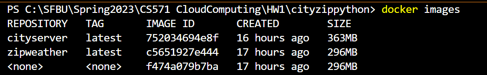
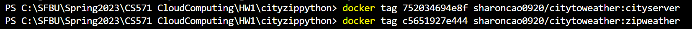
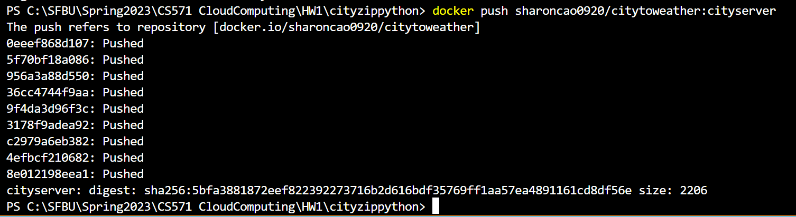
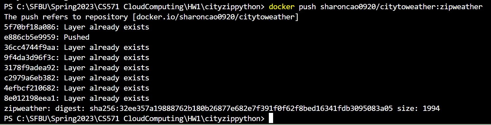
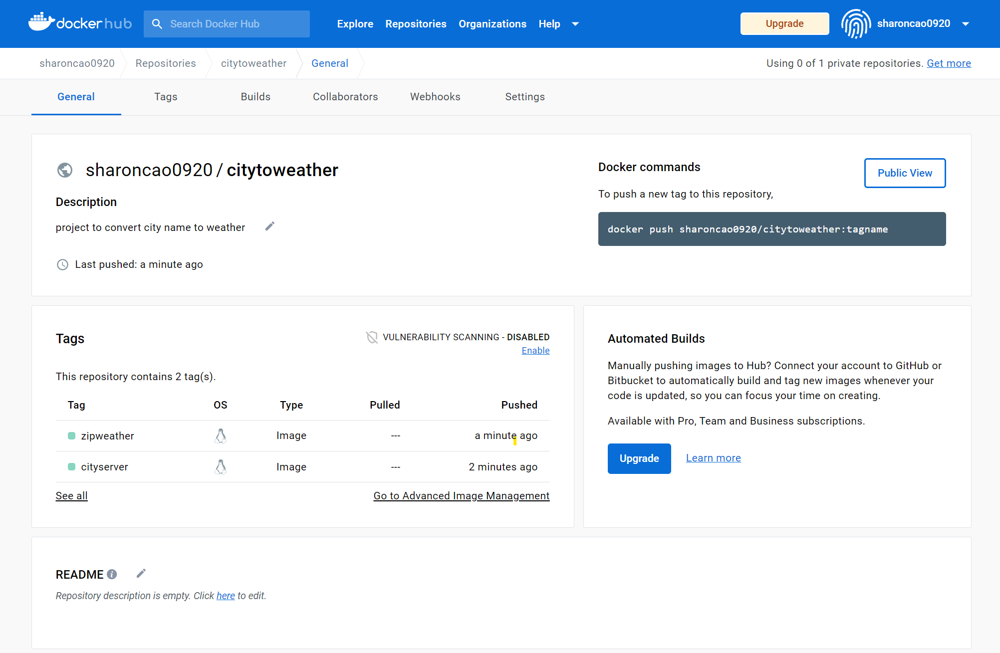

# **City - Weather Project**
*This project is to convert City name search to Weather information with Microservices*


## **Create Two Microservices**

* **Microservice 1:** Convert City Name to Zipcode


[**Details**](https://github.com/SharonCao0920/CloudComputing/tree/main/Docker/CityWeatherProject/CityZipcode)

* **Microservice 2:** Convert Zipcode to Weather information


[**Details**](https://github.com/SharonCao0920/CloudComputing/tree/main/Docker/CityWeatherProject/ZipWeather)

## **Docker Desktop Images and Containers**


## **Push Images to DockerHub**
Check Images Created
```
$ docker images
```


Create tags for Images
```
$ docker tag 752034694e8f sharoncao0920/citytoweather:cityserver 
$ docker tag c5651927e444 sharoncao0920/citytoweather:zipweather
```


Push Image Tags to DockerHub
```
$ docker push sharoncao0920/citytoweather:cityserver
```


```
$ docker push sharoncao0920/citytoweather:zipweather
```


Check Result on DockerHub


