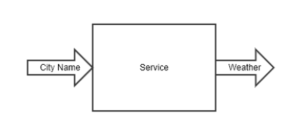
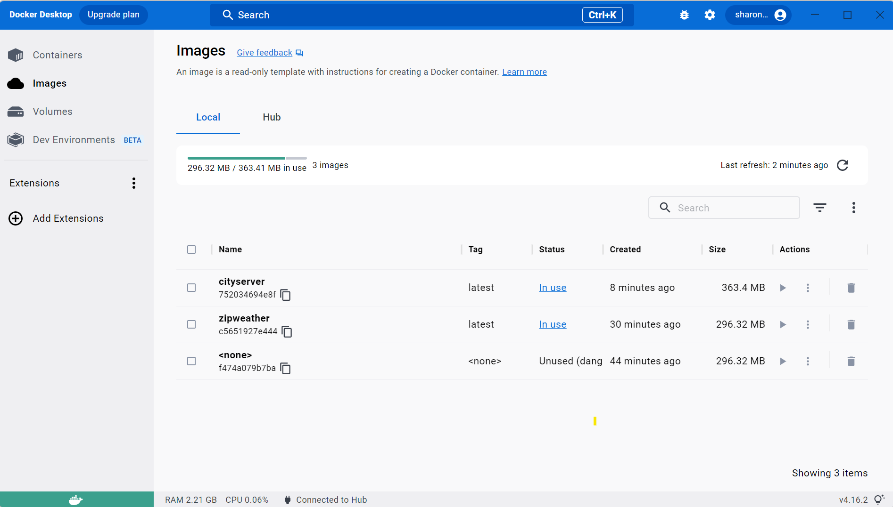
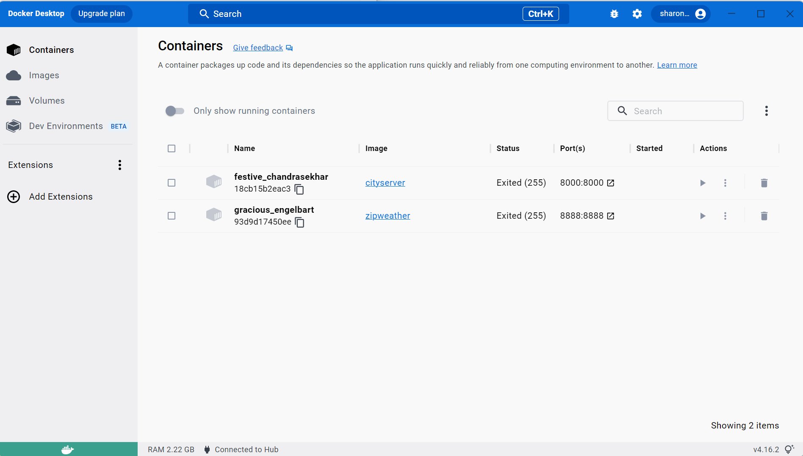

# **City - Weather Project**
*This project is to convert City name search to Weather information with Microservices*

## **Create Two Microservices**

* **Microservice 1:** Convert City Name to Zipcode

[Details](https://github.com/SharonCao0920/CloudComputing/tree/main/Docker/CityWeatherProject/CityZipcode)

* **Microservice 2:** Convert Zipcode to Weather information

[Details](https://github.com/SharonCao0920/CloudComputing/tree/main/Docker/CityWeatherProject/ZipcodeWeather)

## **Docker Images and Containers**

