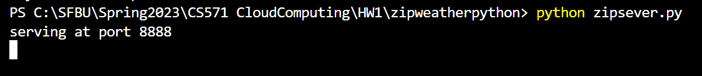
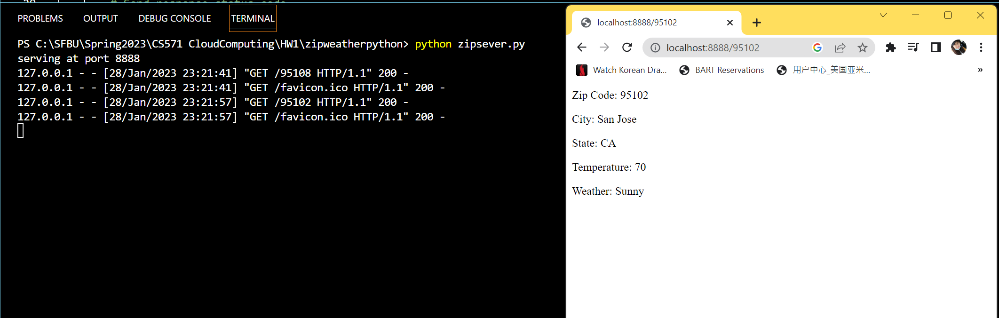
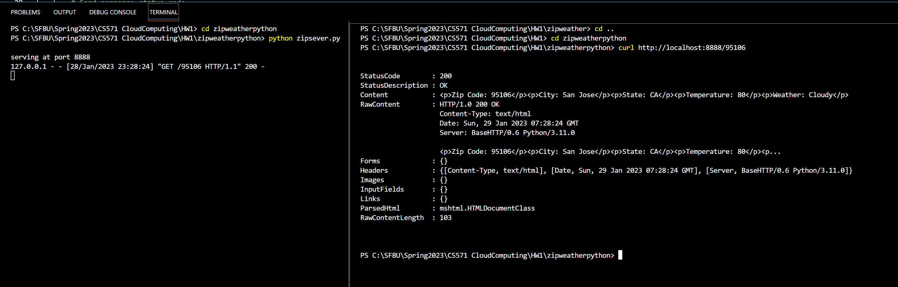
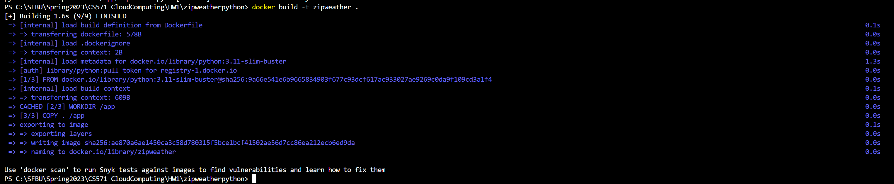
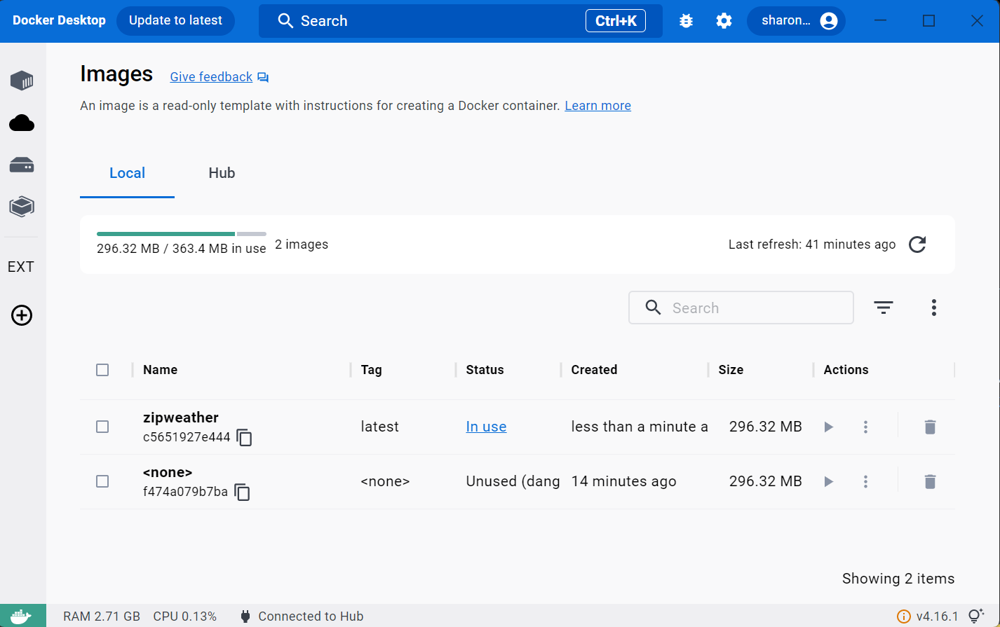
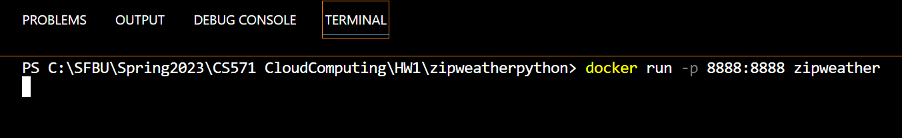
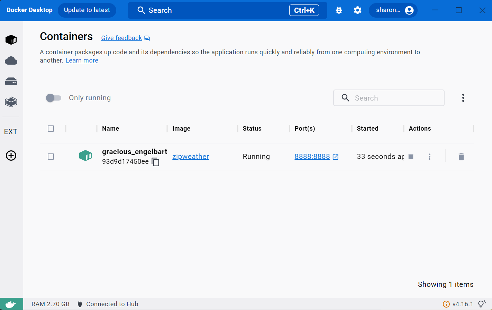
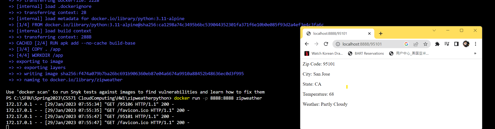

# **Microservice 2: Zipcode to Weather**

## **Setp 1: Create zipserver.py file to take zipcode and output weather**

```
import http.server
import socketserver

# Hard-coded weather data
weather_data = weather_data = {'90210': {'city': 'Beverly Hills', 'state': 'CA', 'temperature': '72', 'weather': 'Sunny'},
                '90211': {'city': 'Beverly Hills', 'state': 'CA', 'temperature': '75', 'weather': 'Cloudy'},
                '90212': {'city': 'Beverly Hills', 'state': 'CA', 'temperature': '80', 'weather': 'Rainy'},
                '90213': {'city': 'Los Angeles', 'state': 'CA', 'temperature': '65', 'weather': 'Partly Cloudy'},
                '90214': {'city': 'Los Angeles', 'state': 'CA', 'temperature': '55', 'weather': 'Rainy'},
                '90215': {'city': 'Santa Monica', 'state': 'CA', 'temperature': '80', 'weather': 'Sunny'},
                '90216': {'city': 'Santa Monica', 'state': 'CA', 'temperature': '90', 'weather': 'Sunny'},
                '90217': {'city': 'Los Angeles', 'state': 'CA', 'temperature': '75', 'weather': 'Partly Cloudy'},
                '90218': {'city': 'Los Angeles', 'state': 'CA', 'temperature': '85', 'weather': 'Sunny'},
                '90219': {'city': 'Los Angeles', 'state': 'CA', 'temperature': '70', 'weather': 'Partly Cloudy'},
                '90220': {'city': 'Los Angeles', 'state': 'CA', 'temperature': '80', 'weather': 'Sunny'},
                '90221': {'city': 'Los Angeles', 'state': 'CA', 'temperature': '65', 'weather': 'Partly Cloudy'},
                '95101': {'city': 'San Jose', 'state': 'CA', 'temperature': '68', 'weather': 'Partly Cloudy'},
                '95102': {'city': 'San Jose', 'state': 'CA', 'temperature': '70', 'weather': 'Sunny'},
                '95103': {'city': 'San Jose', 'state': 'CA', 'temperature': '72', 'weather': 'Rainy'},
                '95104': {'city': 'San Jose', 'state': 'CA', 'temperature': '75', 'weather': 'Partly Cloudy'},
                '95105': {'city': 'San Jose', 'state': 'CA', 'temperature': '78', 'weather': 'Sunny'},
                '95106': {'city': 'San Jose', 'state': 'CA', 'temperature': '80', 'weather': 'Cloudy'},
                '95107': {'city': 'San Jose', 'state': 'CA', 'temperature': '82', 'weather': 'Rainy'},
                '95108': {'city': 'San Jose', 'state': 'CA', 'temperature': '85', 'weather': 'Sunny'}}


class WeatherHandler(http.server.BaseHTTPRequestHandler):
    def do_GET(self):
        # Send response status code
        self.send_response(200)

        # Send headers
        self.send_header('Content-type','text/html')
        self.end_headers()

        # Get the zip code from the request URL
        zip_code = self.path.strip("/")

        # Look up the weather data for the given zip code
        if zip_code in weather_data:
            data = weather_data[zip_code]
            weather_html = "<p>Zip Code: " + zip_code + "</p>"
            weather_html += "<p>City: " + data['city'] + "</p>"
            weather_html += "<p>State: " + data['state'] + "</p>"
            weather_html += "<p>Temperature: " + data['temperature'] + "</p>"
            weather_html += "<p>Weather: " + data['weather'] + "</p>"
        else:
            weather_html = "<p>Weather data not found for zip code: " + zip_code + "</p>"

        # Send the HTML
        self.wfile.write(bytes(weather_html, "utf8"))
        return

# Create an HTTP server and define the handler to manage the incoming request
# Use port number 8888
with socketserver.TCPServer(("", 8888), WeatherHandler) as httpd:
    print("serving at port 8888")
    httpd.serve_forever()

```

## **Step 2: Test zipserver.py**
### **1) In Broswer**

* Run zipserver.py
```
$ python zipserver.py
```



* Open browser with URL: http://localhost:8888/[zipcode]
<br/>





### **2) With curl**

```
$ curl http://localhost:8000/[zipcode]
```




## **Step 3: Create Dockerfile**
```
FROM python:3.11-alpine

RUN apk add --no-cache build-base

COPY . /app

WORKDIR /app

EXPOSE 8888

CMD ["python", "zipserver.py"]
```


## **Step 4: Build Image**
### **Build Image**
```
$ docker build -t zipweather .
```


### **Check on Docker**



## **Step 5: Start a Container from this Image**

### **Run Container**
docker run -p 8888:8888 [Imagename]
```
$ docker run -p 8888:8888 zipweather
```


### **Check on Docker**


## Reuslt


