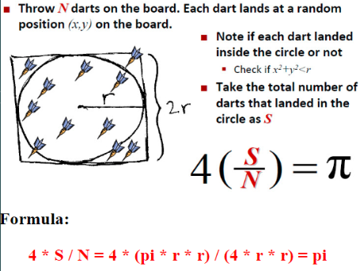
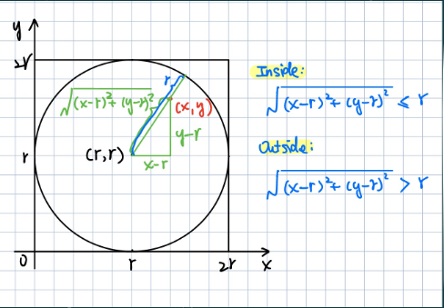
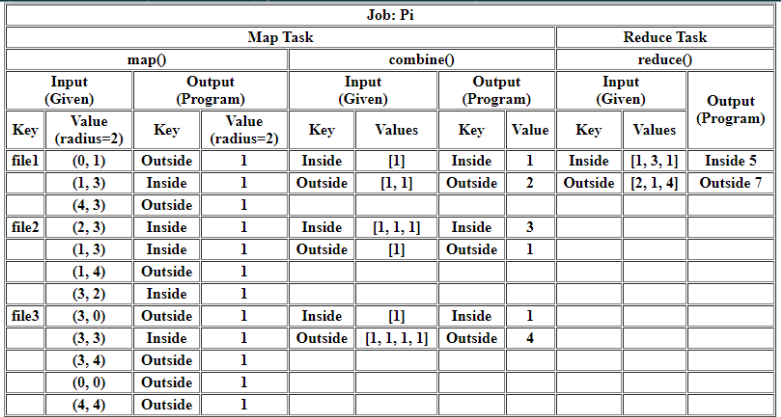
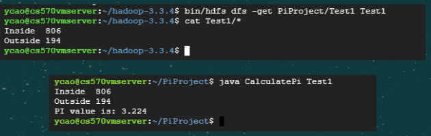
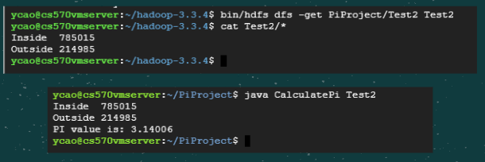

# Pi Project

This Pi Project is to using Hadoop-3.3.4 as the framework to run the MapReduce model to calculate pi value. 

## Introduction

The value of pi can be calculated by counting the number of random darts that  falls in the circle and outside the circle. 
* Theory


* Determine inside or outside



## Design

### Technologies

* Using GCP Ubuntu as project environment. 
* Using Hadoop framework to implement MapReduce model.
* Program in Java Language.



### Process

* Prepare Input File
* Code for MapReduce
* Run Mapreduce on GCP
* Calculate Pi


## Implementation

* Environment
    * Enable GCP instance
    * ssh Connect with localhost
* Code

   * GenerateDots.java
      * Generate random dots with command line arguments as radius and number of pairs
      * Dots generated will be saved in file

   * CalculatePiMR.java
      * MapReduce Program

   * CalculatePi.java
      * Read MapReduce output file and use data to calculate pi value

## Test

Process to test the project.

#### Steps
1. Format the file system
```
$ bin/hdfs namenode -format
```
   
2. Start namenode
```
$ sbin/start-dfs.sh
```

3. Reconnect if permission denied
```
$ ssh-keygen -t rsa -P '' -f ~/.ssh/id_rsa
$ cat ~/.ssh/id_rsa.pub >> ~/.ssh/authorized_keys
$ chmod 0600 ~/.ssh/authorized_keys
$ ssh localhost
```

4. confirm connection
```
$ wget http://localhost:9870/
```

5. Compile and run java program
```
$ javac GenerateDots.java
```

6. Save output in .txt file
```
$ java GenerateDots 5 1000 > ./Input/dots.txt
```

7. Make directories
```
$ bin/hdfs dfs -mkdir /user
$ bin/hdfs dfs -mkdir /user/ycao
$ bin/hdfs dfs -mkdir /user/ycao/PiProject
$ bin/hdfs dfs -mkdir /user/ycao/PiProject/Input
```

8. Copy input file from local to hadoop and check
```
$ bin/hdfs dfs -put ../PiProject/Input/* PiProject/Input
$ bin/hdfs dfs -ls PiProject/Input
```

9. Compile Mapreduce program in Hadoop and create .jar file
```
$ bin/hadoop com.sun.tools.javac.Main ./CalculatePiMR.java
$ jar cf pi.jar CalculatePiMR*.class
```

10. Run MapReduce Program with input file and save result in Output
```
$ bin/hadoop jar pi.jar CalculatePiMR /user/ycao/PiProject/Input /user/ycao/PiProject/Output
```


#### Results
Get output and save to local and display Output
```
$ bin/hdfs dfs -get PiProject/Output Output
$ cat Output/*
```

Compile CalculatePi.java and use the output from MapReduce Program to run java program to get pi value
```
$ jvac CalculatePi.java
$ java CalculatePi Output
```


## Enhancement

HOW TO PROVE TEST RESULTS?

* Method 1: Decrease Radius  



* Method 2: Increase Dots Generated




## Conclusion
The more random dots generated to cover the area, the more accurate pi value we will get. This is determined by radius and number of dots generated.


## References

Chang, H. (2022, 10 09). Overview of Pi Calculation. Overview of Pi Calculation. https://hc.labnet.sfbu.edu/~henry/npu/classes//mapreduce/pi/slide/overview.html   

Strengths and Weaknesses of MapReduce. (2016, September 11). LinkedIn. Retrieved October 10, 2022, from https://www.linkedin.com/pulse/strengths-weaknesses-mapreduce-muazzam-ali 

Taylor, D. (2022, September 17). What is MapReduce in Hadoop? Big Data Architecture. Guru99. Retrieved October 10, 2022, from https://www.guru99.com/introduction-to-mapreduce.html 

Value of Pi in Maths - Definition, Forms & Solved Examples. (n.d.). Byju's. Retrieved October 10, 2022, from https://byjus.com/maths/value-of-pi/  


