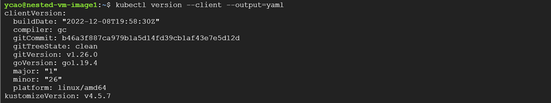
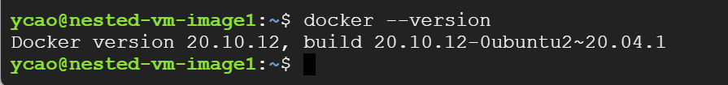

## **Section 1: Create Image**

#### **Active Cloud Shell on GCP**


 
#### **Determine zone support for Intel Haswell Platform**
```
$ gcloud compute zones describe us-west1-b
```


#### **reate a staging disk**
```
$ gcloud compute disks create stagingdisk --image-project ubuntu-os-cloud --image-family ubuntu-2004-lts --zone us-west1-b
```


*Note: https://cloud.google.com/compute/docs/images/os-details  
Check Ubuntu LTS Image configuration*

 
#### **Create a nested VM**
```
$ gcloud compute images create nested-vm-image --source-disk=stagingdisk --source-disk-zone=us-west1-b --licenses=https://www.googleapis.com/compute/v1/projects/vm-options/global/licenses/enable-vmx
```


 
#### **Delete the source disk we created temporarily as a staging disk**
```
$ gcloud compute disks delete stagingdisk --zone us-west1-b
```

 
#### **Create Image**
```
$ gcloud compute instances create nested-vm-image1 --zone us-west1-b --min-cpu-platform "Intel Haswell" --machine-type n1-standard-4 --image nested-vm-image
``` 


#### **Verify VM in Console**
 


#### **Connect to VM**
 
  

#### **Verify the VM is online**
```
$ grep -cw vmx /proc/cpuinfo
```
 


## **Section 2: Install tools**

## *Install kubectl binary with curl*
[Kubectl Information Page](https://kubernetes.io/docs/tasks/tools/install-kubectl-linux/ )


#### **Download the latest release with the command:**
```
$ curl -LO "https://dl.k8s.io/release/$(curl -L -s https://dl.k8s.io/release/stable.txt)/bin/linux/amd64/kubectl" 
```
 
 
#### **Validate the binary (optional)**
```
$ curl -LO "https://dl.k8s.io/$(curl -L -s https://dl.k8s.io/release/stable.txt)/bin/linux/amd64/kubectl.sha256"
$ echo "$(cat kubectl.sha256)  kubectl" | sha256sum --check
```


#### **Install kubectl**
```
$ sudo install -o root -g root -m 0755 kubectl /usr/local/bin/kubectl
```

 
#### **Test to ensure the version you installed is up-to-date:**
```
$ kubectl version --client
```

or
```
$ kubectl version --client --output=yaml    
```

 
## *Install Minikube*
[Minikube Information Page](https://minikube.sigs.k8s.io/docs/start/ )

#### **Install package**
```
$ curl -LO https://storage.googleapis.com/minikube/releases/latest/minikube-linux-amd64
$ sudo install minikube-linux-amd64 /usr/local/bin/minikube
```

 
#### **Move minikube**
```
$ sudo cp minikube /usr/bin/
```


## *Install Docker*
#### **Install VirtualBox and extension package**
```
$ sudo apt-get install curl wget apt-transport-https virtualbox virtualbox-ext-pack -y
``` 


#### **Install docker.io**
```
$ sudo apt-get install docker.io
```

 
#### **Verify**
```
$ docker --version
```

 
## **Section 3: Prepare Application**

#### **Start Docker and Install Conntrack**
```
$ sudo service docker start
$ sudo apt-get install conntrack
``` 


#### **Start Minikube**
```
$ cd /usr/bin
$ minikube start
```

 
#### **Creating files**

* Making a project folder
    ```
    $ mkdir dockerImg
    $ cd dockerImg
    ```
    
 
* `$ vi app.js`
    ```
    const http = require('http');
    const os = require('os');

    console.log("Kubia server starting...");

    var handler = function(request, response) {
            console.log("Received request from "+ request.connection.remoteAddress);
            response.writeHead(200);
            response.end("You've hit " + os.hostname() + "\n");
    };

    var www = http.createServer(handler);

    www.listen(8080);
    ```
    
 

* `$vi Dockerfile`
    ```
    FROM node:7
    ADD app.js /app.js
    ENTRYPOINT [“node”, “app.js”]
    ```
    
 

#### **Build docker image**
```
$ sudo docker build -t kubia .
```


#### **Run image on a container on localhost**
```
$ sudo docker run --name kubia-container -p 8080:8080 -d kubia
```

#### **Create Account at https://hub.docker.com/ and Login**
 
``` 
$ sudo docker login
```
*Note: create repository in console*

#### **Push Tag to Docker Hub Repository**
```
$ sudo docker tag kubia sharoncao0920/kubernetes_2023:kubia
$ sudo docker push sharoncao0920/kubernetes_2023:kubia  
```
 

## **Section 4: Run Application on Kubernetes**

### **Minikube**

* Get cluster information
    ```
    $ kubectl cluster-info
    ``` 

* ` $vi kubia_rc.yaml`
    ```
    apiVersion: v1
    kind: ReplicationController
    metadata:
    name: kubia
    spec:
    replicas: 3
    selector:
        app: kubia
    template:
        metadata:
        name: kubia
        labels:
            app: kubia
        spec:
        containers:
        - name: kubia-container
            image: sharoncao0920/kebernetes_2023
            ports:
            - containerPort: 8080
    ``` 

* Apply yaml file
    ```
    $ kubectl apply -f kubia-rc.yaml
    ```


* Run image
    ```
    $ sudo docker run -p 8080:8080 -d sharoncao0920/kubernetes_2023
    $ kubectl run kubia --image=sharoncao0920/kubernetes_2023 --port=8080
    ``` 


* Get pods information
    ```
    $ kubectl get pods
    ``` 
    *Note: it may take time to get all pods ready, re-run the command to get updated status*
 

* Start tunnel
    ```
    $ minikube tunnel
    ```

* Open another terminal and expose a service
    ```
    $ kubectl expose pod kubia --type=LoadBalancer --port 8080
    ```

* List services
    ```
    $ kubectl get svc
    ```

* Verify the service is reachable
    ```
    $ curl 10.103.29.158:8080
    ```
 


* Other commands maybe useful

    Show images information on Docker `$ sudo docker images`

    Replication controller information `$ kubectl describe replicationcontrollers/kubia`


GKE

$ gcloud container clusters create kubia --num-nodes=1 --machine-type=e2-micro --region=us-west1

 
Enable Kubernetes API on GCP 
 
 
$ gcloud container clusters create kubia --num-nodes=1 --machine-type=e2-micro --region=us-west1
 
$ kubectl get nodes
 


