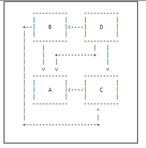
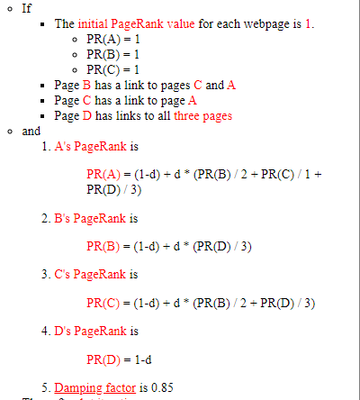
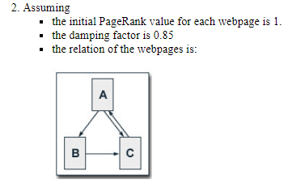
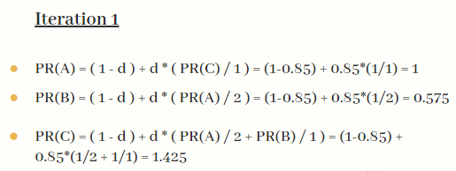
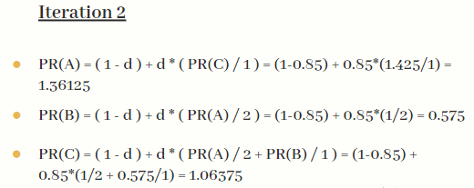
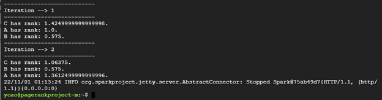
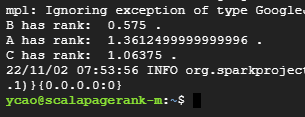
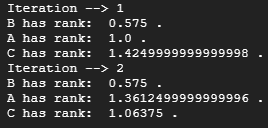
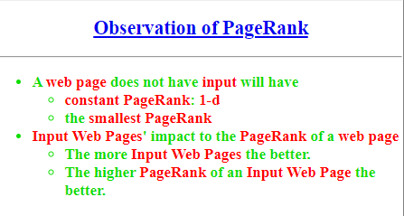

 # PageRank Project

This PageRank Project is to implemente PageRank algorithm with PySpark and Scala.

**[PageRank Project Google Slides](https://docs.google.com/presentation/d/1ILLveSol3wyDaY8U17LL0d7b7DekkJGwxkWpVfXO8aM/edit?usp=sharing)**

## Introduction

PageRank (PR) is an algorithm used by Google Search to rank websites in their search engine results. 
* **Theory**
PageRank works by counting the number and quality of links to a page to determine a rough estimate of how important the website is. The underlying assumption is that more important websites are likely to receive more links from other websites.

* **Example**






## Design

* Manual Solution
* Implement Pyspark and Scala
* Compare results

## Implementation
* Manual Solution
 
 
 
 
 

* Pyspark
  * Environemnt Setup
  * Code for program
 
* Scala
  * Environemnt Setup
  * Code for program
  
## Test

Process to test the project.

#### Pyspark
* Make directory in file system

```
$ hdfs dfs -mkdir hdfs:///data
$ hdfs dfs -mkdir hdfs:///data/mllib
```
   
* Copy input file from local to system

```
$ hdfs dfs -put ./data/mllib/* hdfs:///data/mllib
```

*  Execute pyspark program with command line arguments

```
$ spark-submit PageRankProject/pagerank.py hdfs:///data/mllib/pagerank_data.txt 2
```

* Result



#### Scala

#### M1: Test With PageRank Example in package

* Copy input file from local to system

```
$ hdfs dfs -put links.txt .
```

*  Execute scala program with command line arguments

```
$ run-example SparkPageRank links.txt 2
```

* Result



##### M2: Test in Spark Shell with Modified Code

* Copy input file from local to system

```
$ hdfs dfs -mkdir hdfs:///pagerank
$ hdfs dfs -put links.txt hdfs:///pagerank
```

*  Run code line by line within shell


* Result




## Enhancement

* Compare Results

* Observation



## Conclusion
Results matches.
Personally prefer using Pyspark.


## References

Musib, A. (2022, September 6). Page Rank Algorithm and Implementation. GeeksforGeeks. Retrieved October 31, 2022, from https://www.geeksforgeeks.org/page-rank-algorithm-implementation/ 

Gaga, L., & Cooper, B. (2022, January 17). ??? ??? - YouTube. Retrieved October 31, 2022, from https://hc.labnet.sfbu.edu/~henry/npu/classes/learning_spark/key_value_pair/slide/Example_PageRank.html 

